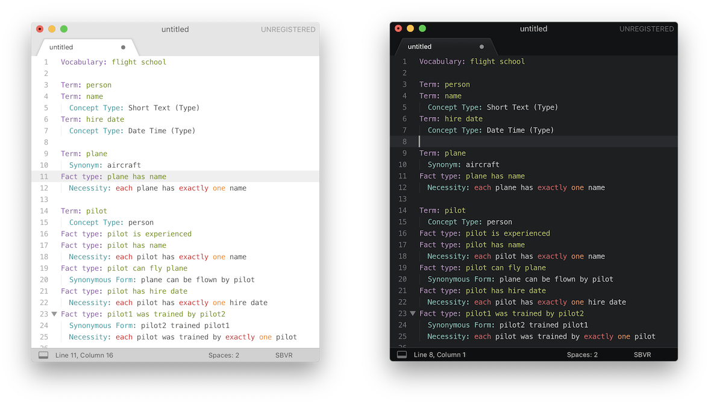

SBVR Syntax
===========

`sbvr-syntax` provides code editor syntax highlighting for [SBVR][sbvr]. The
syntax understood is mostly that used by [balena][balena] in various projects.
Currently only [Sublime Text 3][st3] is supported, though PRs to support other
editors are welcome.

[sbvr]: https://www.omg.org/spec/SBVR/
[balena]: https://balena.io/
[st3]: http://www.sublimetext.com/

## Installation

Installation is currently manual:

1. In Sublime Text, open *Preferences* → *Browse Packages...*. This will open
   the Sublime Text Packages directory in the Finder.
2. [Download and unzip][zip] or clone this repository into the packages
   directory.
3. Rename the project directory to *SBVR*.
4. Restart Sublime Text to complete the installation.
5. Done. Now open an SBVR file and enjoy!

[zip]: https://github.com/balena-io-playground/sbvr-syntax/archive/master.zip

## Contributing

You're most welcome to contribute or suggest improvements. Here are a few areas
you may want to help with:

- Syntax improvements.
- Support for other editors. VSCode is particularly welcome.
- Bundled snippets.
- Installation via Package Control.

## License

`sbvr-syntax` is licensed under the Apache 2.0 license; see [LICENSE](LICENSE).
